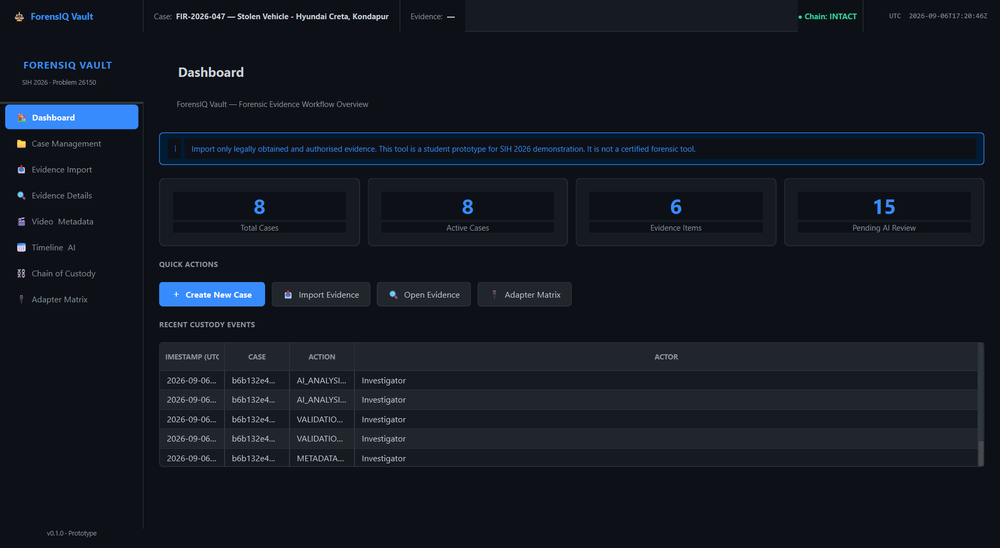
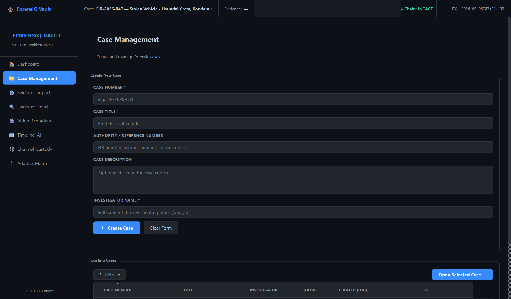
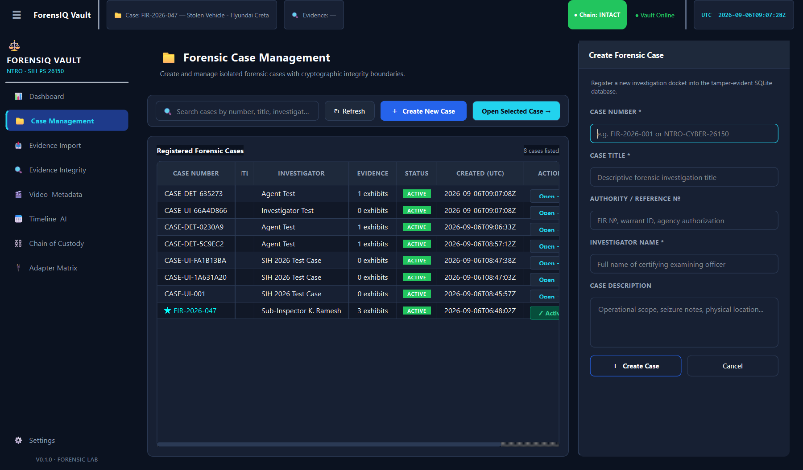
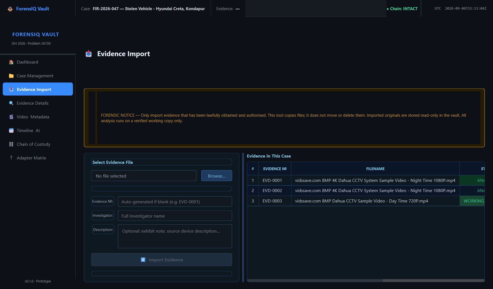
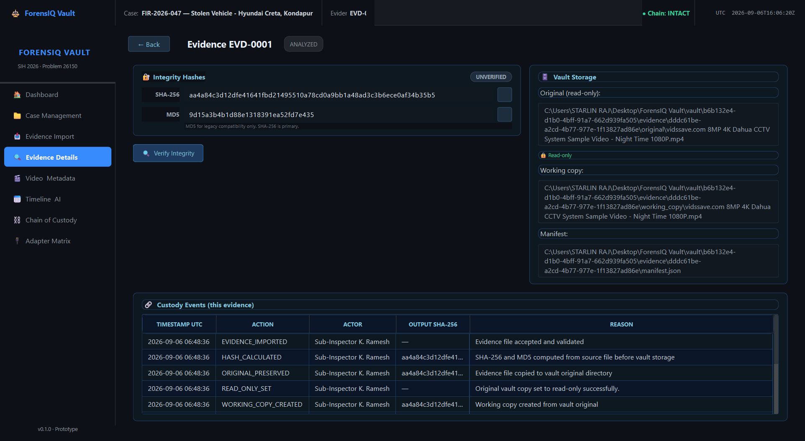
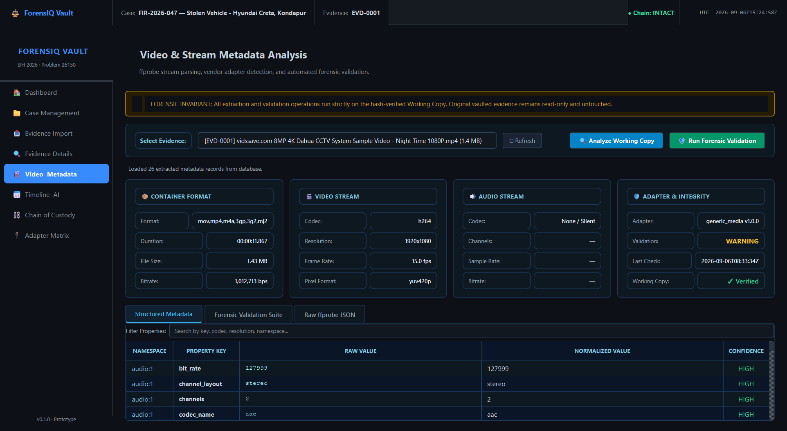
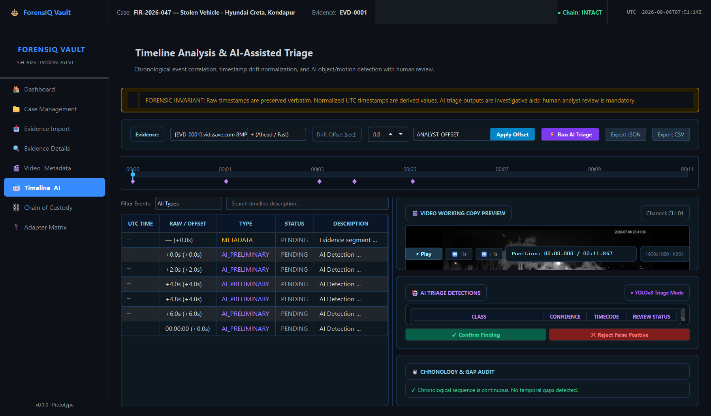
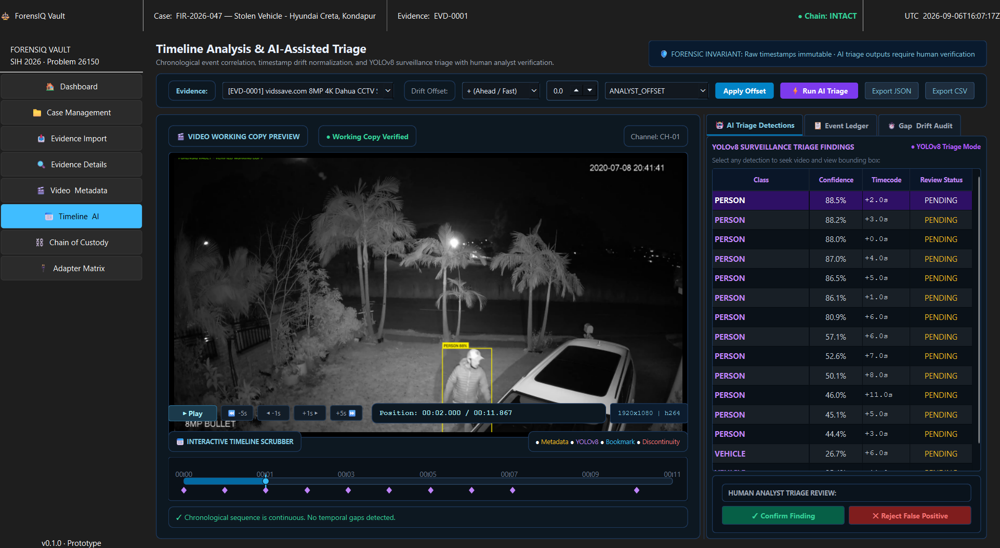
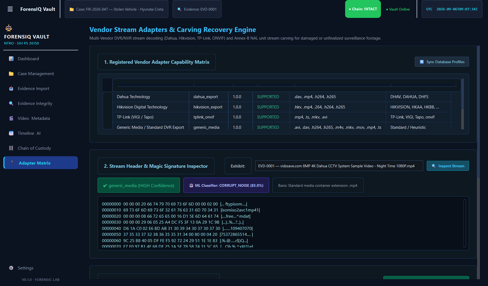
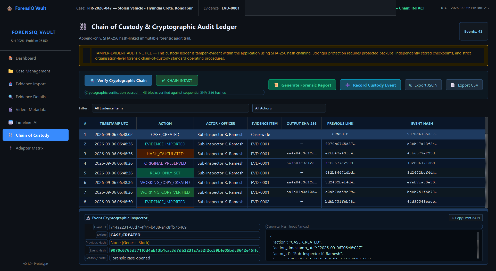

# ForensIQ Vault — Operator User Manual

**Smart India Hackathon 2026** | **Problem Statement 26150 (NTRO)**  
**Theme**: Blockchain & Cybersecurity  
**Document Classification**: User & Operator Guidance  
**Target Audience**: Law Enforcement Investigators, Forensic Analysts, Digital Evidence Custodians  

---

## 1. Introduction & Operating Philosophy

ForensIQ Vault is a dedicated forensic workstation application designed for the acquisition, vendor format parsing, timeline reconstruction, and court-admissible reporting of seized CCTV, DVR, and NVR surveillance systems.

### Core Operational Principles
1. **Evidence Sanctity**: Original seized evidence (files or raw disk images) is locked read-only (`0444`) immediately upon creation/ingestion.
2. **Analysis on Working Copies Only**: All indexing, frame extraction, AI triage, and carving operations execute exclusively on verified working copies.
3. **Cryptographic Accountability**: Every action performed by any operator is recorded in an immutable, append-only SHA-256 Merkle-linked custody ledger.
4. **Zero Invented Metadata**: If a timestamp or header cannot be parsed with cryptographic or vendor certainty, it is explicitly flagged as `None` or `Unknown`, never fabricated.

---

## 2. System Launch & Main Dashboard

When ForensIQ Vault is launched, the operator is greeted by the Main Dashboard.

### Key Dashboard Elements:
- **Active Case Overview**: Displays the currently open case, case number, assigned investigating officer, and active evidence exhibits.
- **Evidence Health & Storage Summary**: Reports total seized storage capacity, count of ingested exhibits, and verified working copies.
- **Quick Action Bar**: Provides direct single-click navigation to Case Management, Forensic Ingestion, Video Analytics, Hex Inspection, and Report Generation.
- **Chain of Custody Status Banner**: Real-time indicator displaying whether the cryptographic ledger is intact (Green Verified) or tampered (Red Alert).

---

## 3. Step 1: Case Creation & Management

Every forensic investigation must begin by establishing a distinct, cryptographically isolated Case Container.

### 3.1 Creating a New Case
1. Navigate to **Case Management** on the sidebar navigation menu.
2. Click **Create Case** in the upper right toolbar to open the Case Details Drawer.
3. Enter the required judicial identification parameters:
   - **Case Number / FIR Number**: (e.g., `FIR-2026-CR-0894`)
   - **Case Title / Operation Name**: (e.g., `Operation CyberEye Perimeter Breach`)
   - **Lead Investigator / Operator**: (e.g., `Insp. S. R. Varma, Cyber Cell`)
   - **Jurisdiction / Agency**: (e.g., `National Technical Research Organisation / Special Crime Unit`)
   - **Case Description & Notes**: Summary of seizure circumstances, location, and seized hardware context.
4. Click **Create Case & Initialize Ledger**.

> [!NOTE]
> Creating a case automatically generates the cryptographic **Genesis Block** in the case's custody ledger. The genesis hash is seeded with the case parameters and sets `previous_event_hash` to sixty-four zeros (`0000000000000000000000000000000000000000000000000000000000000000`).

---

## 4. Step 2: Evidence Acquisition & Ingestion

ForensIQ Vault supports two acquisition modalities: **Physical Forensic Imaging (.img)** and **Export File Ingestion**.

### 4.1 Modality A: Forensic Acquisition (`.img` Bit-Stream Image)
Use this modality when seizing physical DVR hard disks, flash cards, or raw block dumps.
1. In the **Evidence Acquisition** screen, select the **Forensic Acquisition (.img)** tab.
2. **Source Device / Dump Path**: Select the physical disk partition (e.g., `\\.\PhysicalDrive2`) or raw disk image (e.g., `EX04_Damaged_DVR_Carve_Target.raw`).
3. **Block Size**: Choose the acquisition buffer size (`64 KB` for fragmented media, `1 MB` for high-throughput SSDs).
4. **Simulated Write-Block Mode**: Keep enabled for demonstration environments or software-assisted acquisition. (When hardware write-blockers like Tableau or WiebeTech are connected, physical hardware write-blocking is respected).
5. Click **Start Bit-Stream Acquisition**.
6. The system executes a sequential streaming copy, computing SHA-256 and MD5 simultaneously.
7. Upon completion, the system automatically performs an independent second verification pass, writes `imaging_manifest.json`, locks the `.img` file with read-only permissions (`chmod 0444`), generates an SHA-256-verified working copy, and logs `IMAGE_CREATED` and `IMAGE_VERIFIED` to the custody chain.

### 4.2 Modality B: Direct Export Ingestion
Use this modality when evidence was exported via DVR USB backup onto thumb drives (e.g., `.dav`, `.uvf`, `.hos`, `.mp4`).
1. Select the **File Ingestion** tab.
2. Browse to the exported file or drag-and-drop the file into the drop target.
3. Fill in **Exhibit Identifier** (e.g., `EX-01`), **Camera Label / Channel ID**, and **Seizure Location**.
4. Click **Ingest & Verify Evidence**.
5. The system stores the original evidence under `vault/{case_id}/evidence/{evidence_id}/original/`, sets read-only permissions, and replicates a working copy under `working_copy/`.

---

## 5. Step 3: Evidence Details & Chain of Custody Audit

Once ingested, the evidence is inspected in the **Evidence Details** view.

### 5.1 Verifying Cryptographic Hashes
- Inspect the displayed **SHA-256** and **MD5** digital fingerprints.
- Click **Re-Verify Hash Now** at any time. ForensIQ Vault will stream-hash the working copy and compare it against the original evidence record.
- If hashes match, a green **INTEGRITY VERIFIED** badge is displayed. If any byte has been altered, a red alert is triggered immediately.

---

## 6. Step 4: Video Metadata & Vendor Adapter Detection

Click on **Video Metadata** to inspect the internal codec structures and automatic OEM identification.

### 6.1 Automated Vendor Adapter Detection
ForensIQ Vault inspects binary header signatures against its registered OEM adapters:
1. **Dahua Technology**: `DHAV` proprietary stream header (or `.dav` fallback).
2. **Hikvision**: `HKH4` / `HIKG` packaging and RTP timestamp sync words.
3. **CP Plus**: `CPPLUS` / `CPPL` signature and Orange-OS index structure.
4. **Uniview (UNV)**: `UBVR` / `UNV` header and UVF frame index tables.
5. **Honeywell Security**: `HONEYWELL` / `HOS` headers and MAXPRO NVR export wrappers.
6. **TP-Link VIGI / Tapo**: Standard ONVIF Profile S/G compliant ISO-BMFF containers.

### 6.2 Stream Technical Profile
The metadata panel displays:
- Video Resolution (e.g., 1920x1080 @ 25.00 fps)
- Codec ID (`H.264 / AVC`, `H.265 / HEVC`)
- Encoded Aspect Ratio & Color Space
- Container Creation Timestamp vs Stream Embedded RTC Timestamps

---

## 7. Step 5: Timeline Analysis & Offline AI Video Triage

Surveillance investigations typically require reviewing dozens of hours of footage. The **Timeline & AI Triage** module automates candidate frame selection while strictly respecting legal constraints.

### 7.1 Running AI Video Triage
1. Navigate to **Timeline & AI**.
2. Select the target evidence exhibit from the dropdown.
3. Configure the triage sampling interval (e.g., 1 frame per second).
4. Click **Execute Offline AI Triage**.
5. The offline model categorizes frames into:
   - **Person** (Pedestrian silhouette presence)
   - **Vehicle** (Automobile, truck, two-wheeler)
   - **Motion** (General perimeter movement)
   - **Scene Change** (Camera obstruction, spray paint, sudden lighting shift)
   - **Anomaly** (Unusual speed or direction)

### 7.2 Strict Biometric Exclusion Policy
> [!IMPORTANT]
> **Ethical & Legal Compliance**: ForensIQ Vault provides **presence detection only**. Facial recognition, biometric template extraction, and automated identity linkage are strictly prohibited and disabled in compliance with Section 63 BSA 2023 and the Digital Personal Data Protection (DPDP) Act 2023.

---

## 8. Step 6: Deep Recovery & Sector Carving

When surveillance hard drives have been formatted, zeroed, damaged, or deleted by perpetrators, navigate to the **Hex Inspection & Carving** module.

### 8.1 Recovery Workflow:
1. Open **Deep Carving / Recovery**.
2. Select the raw drive image (e.g., `EX04_Damaged_DVR_Carve_Target.raw`).
3. Select Recovery Tier:
   - **Tier 1: Filesystem Index Recovery**: Automatically attempts to scan and reconstruct directory indices (such as Dahua DHFS partition tables or Uniview segment tables). Preserves original channel names and exact recorded timestamps.
   - **Tier 2: Raw Stream Carving (Fallback)**: When index structures are corrupted, the carver scans raw sectors for H.264/H.265 NAL unit start codes (`0x000001` / `0x00000001`), extracts Sequence Parameter Sets (SPS) and Picture Parameter Sets (PPS), and reconstructs standalone playable MP4 containers.
4. Click **Start Deep Recovery Scan**. Carved clips are exported into the case vault and hashed into the custody chain.

---

## 9. Step 7: Judicial Report Generation & Custody Export

The final deliverable of an investigation is a court-admissible forensic package.

### 9.1 Verifying Chain of Custody
1. Navigate to **Custody & Reports**.
2. Review the complete chronological event ledger.
3. Click **Verify Chain Integrity**. The system recomputes the SHA-256 Merkle chain from the Genesis block to the latest action.
4. Ensure the green **CHAIN INTEGRITY: VERIFIED** banner is visible.

### 9.2 Generating Section 65B / Section 63 Legal Certificate
1. Click **Generate Forensic Report**.
2. Choose export formats:
   - **Formal Judicial PDF**: Generates a court-ready document including Case FIR details, Officer Certification, Evidence Hash Manifest, Adapter Findings, Timeline Summary, and Statutory Certificate under **Section 63 of Bharatiya Sakshya Adhiniyam, 2023** (or **Section 65B of Indian Evidence Act, 1872**).
   - **Cryptographic Audit JSON**: Machine-readable JSON export containing the complete Merkle hash chain for submission to independent court examiners or defense experts.
3. Save the signed PDF certificate to official case storage.
